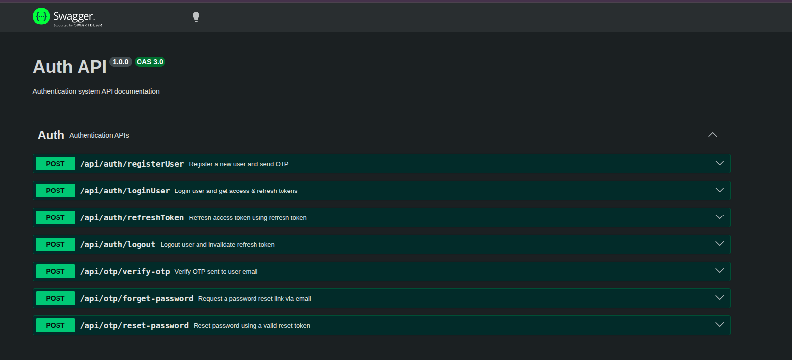
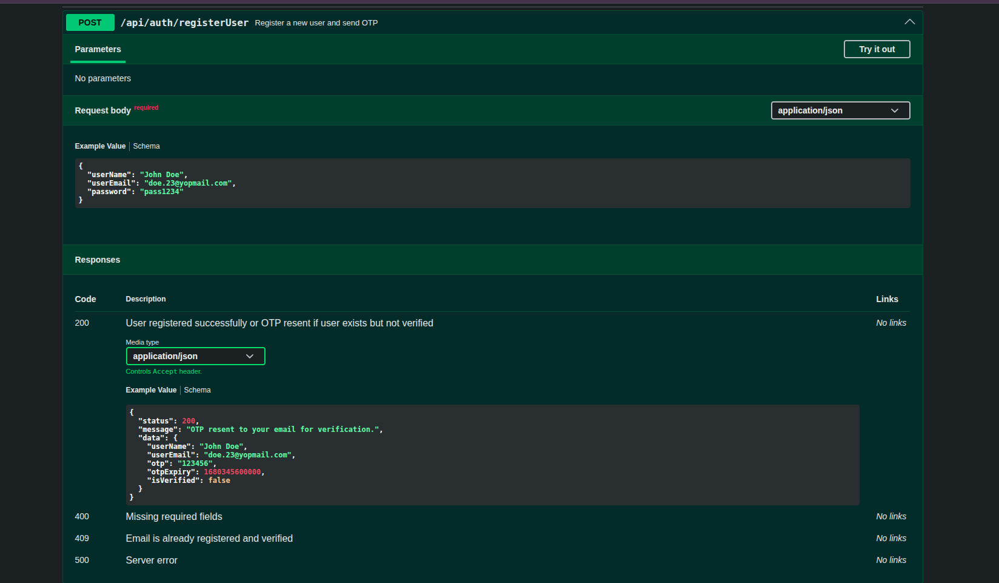

# Node.js Authentication System

A **full-featured Node.js authentication system** with secure user registration, OTP verification, JWT-based login, refresh tokens, password reset, and email notifications.

---

## 🛠 Tech Stack

* **Node.js & Express** – Backend framework
* **MongoDB & Mongoose** – Database
* **JWT** – Access & refresh tokens
* **Crypto** – Secure password reset tokens
* **Joi** – Request validation
* **Nodemailer** – Email notifications
* **HTTP-only cookies** – Secure storage of refresh tokens

---

## ⚡ Features

1. **User Registration**

   * Sends OTP via email (10-minute validity)
   * Resends OTP if not verified
   * Sends registration success email after verification

2. **Login**

   * Generates **access token** and **refresh token**
   * Refresh token stored in DB & sent via HTTP-only cookie

3. **Refresh Token**

   * Endpoint issues a new access token when access token expires

4. **Logout**

   * Clears refresh token in DB, ending session

5. **Forgot & Reset Password**

   * Generates secure reset token
   * Sends reset link via email (10-minute validity)
   * Updates password and sends confirmation email

6. **OTP Verification**

   * Verifies registration OTP
   * Allows resending OTP

7. **Validation**

   * Payload validation via **Joi**

8. **Global Error Handling**

   * Handles server errors (500) consistently

---

##  API Endpoints

| Method | Endpoint          | Description                            |
| ------ | ----------------- | -------------------------------------- |
| POST   | `/registerUser`   | Register user (sends OTP)              |
| POST   | `/verify-otp`     | Verify OTP                             |
| POST   | `/resend-otp`     | Resend OTP                             |
| POST   | `/loginUser`      | Login, receive access & refresh tokens |
| POST   | `/refresh-token`  | Generate new access token              |
| POST   | `/logoutUser`     | Logout, clear refresh token            |
| POST   | `/forgotPassword` | Send password reset link               |
| POST   | `/resetPassword`  | Reset password using token             |

---

##  Project Structure

```
project-root/
│
├─ src/
│   ├─ config/
│   │   ├─ db.js
│   │   └─ swagger.js
│   ├─ controllers/
│   │   ├─ authController.js
│   │   └─ otpController.js
│   ├─ models/
│   │   └─ authModel.js
│   ├─ routes/
│   │   ├─ authRoutes.js
│   │   └─ otpRoutes.js
│   ├─ middleware/
│   │   ├─ validate.js
│   │   ├─ authMiddleware.js
│   │   └─ globalErrorHandler.js
│   ├─ services/
│   │   ├─ generateToken.js
│   │   ├─ sendEmail.js
│   │   └─ templates/
│   ├─ utils/
│   │   ├─ apiResponse.js
│   │   ├─ appError.js
│   │   ├─ generateOtp.js
│   │   └─ statusCodes.js
│   ├─ validation/
│   │   └─ authValidation.js
│   └─ app.js
│
├─ screenShots/                  # Screenshots for README preview
│   ├─ swagger.png
│   ├─ register.png
│
├─ index.js
├─ package.json
├─ package-lock.json
└─ README.md
```

---

## 📷 Screenshots Preview

### Swagger UI



### User Registration



## ⚙ Installation & Setup

1. **Clone the repo**:

```bash
git clone <repo-url>
cd <project-root>
```

2. **Install dependencies**:

```bash
npm install
```

3. **Create `.env` file**:

```text
PORT=3000
MONGO_URI=<your-mongo-uri>
JWT_SECRET=<your-jwt-secret>
JWT_ACCESS_EXPIRES=15m
JWT_REFRESH_EXPIRES=7d
SMTP_HOST=<smtp-host>
SMTP_PORT=<smtp-port>
SMTP_USER=<smtp-user>
SMTP_PASS=<smtp-pass>
CLIENT_URL=<frontend-url>
```

4. **Start the server**:

```bash
npm start
```

5. **Swagger Documentation** available at:

```
http://localhost:3000/api-docs
```

---

## Notes

* Passwords & reset tokens are **hashed securely**
* Refresh tokens are **HTTP-only cookies**
* OTPs & reset links are valid for **10 minutes**
* Use **YOPmail** to test email flows during development
* Global error handler ensures consistent API responses


